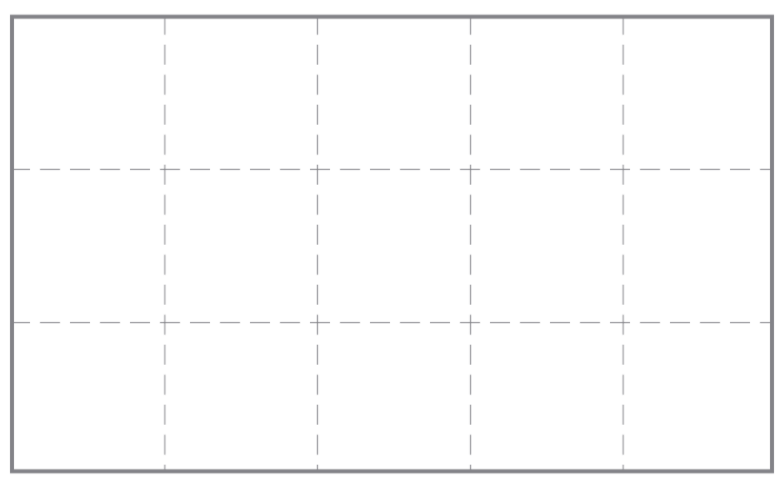
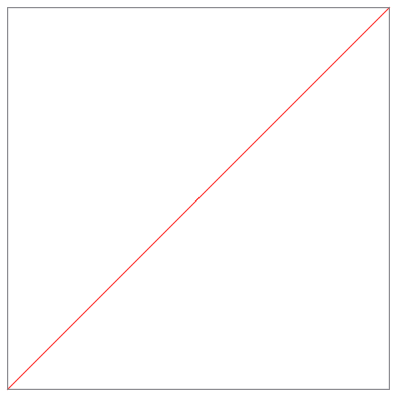
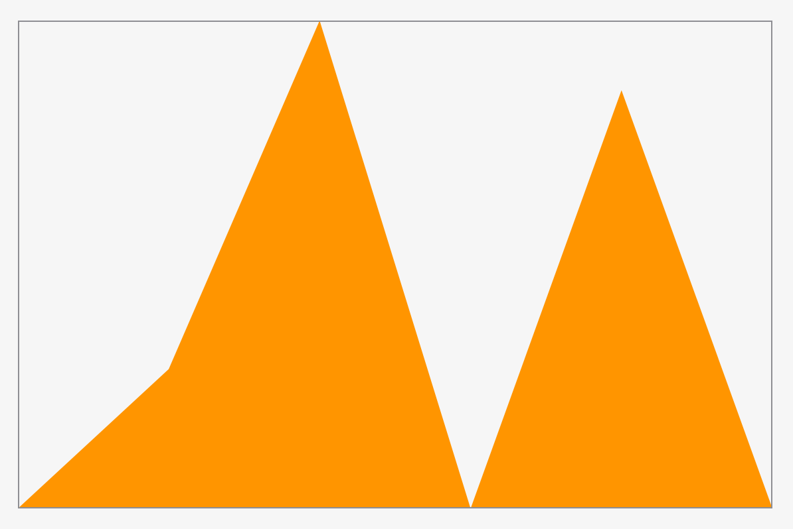
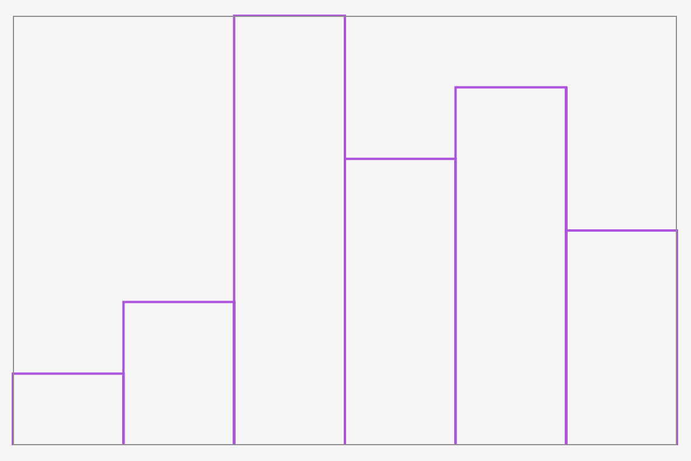

# SUECharts

SwiftUI Charts

<p align="center">
<a href="LICENSE.md">
    
</a>
<a href="https://swift.org">
    
</a>

SUE stands for *S*wift*U*I *E*xtras and is a collection of small SwiftUI libraries for various recurring use cases

## Gallery

### Grid
```swift
Grid(5, 3)
    .stroke(Color.gray, style: StrokeStyle(lineWidth: 0.5, dash: [10,5]))
    .border(Color.gray, width: 2)
    .aspectRatio(5/3, contentMode: .fit)
    .padding()
```


### LinearFunction
```swift
LinearFunction(a: 1, b: 0).stroke(Color.red, lineWidth: 1).aspectRatio(1, contentMode: .fit).border(Color.gray, width: 1).padding()
```



### Graph
```swift
Graph(dataPoints: [12,42,0,36])
    .stroke(Color.blue, lineWidth: 1)
    .border(Color.gray, width: 1)
    .padding()
```


### Bars
```swift
Bars(true, dataPoints: [1,2,6,4,5,3])
    .stroke(Color.purple, lineWidth: 2.0)
    .border(Color.gray, width: 1)
    .padding()
```


## License

MIT license; see [LICENSE](LICENSE.md).
(c) 2020
